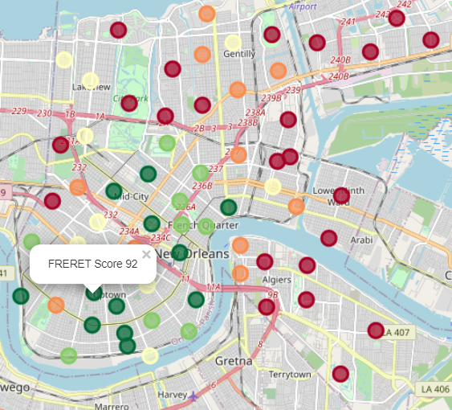
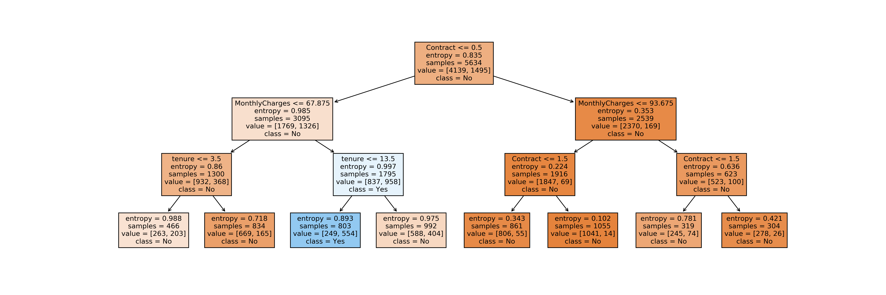

# Marielle Soniat Pointer

**About Me :**
I am interested in using data science and machine learning to drive development of new technologies based on 
novel scientific discoveries. My previous research was in computational physical chemistry including reaction-
diffusion models and molecular dynamics. I enjoy collaborating with a diverse team on intellectually stimulating
problems. 

**Contact Information : mariellesoniatpointer [at] gmail [dot] com**

---

### Data Science Portfolio:
1. [Rate Neighborhoods based on User Preferences](https://mariellesp.github.io/Rate-Neighborhoods/)   
         
   Completed as a capstone project for the IBM Data Science Professional Certificate. The preferences in neighborhood features for two users are given. Each neighborhood in New Orleans, LA, USA is evalated based on the number of desired venue types in Foursquare. A personalized score for each neighborhood is generated. A [web app](https://rate-neighborhoods-app.herokuapp.com/) version is hosted on Heroku. 
  
 
 
 

2. [Prediction of Churn](https://mariellesp.github.io/Churn-DecisionTree/)
 
         

   Loss of customers (churn) means loss of revenue for businesses. Data on customer demographics, service plan, account information, and churn is obtained for a [telecom company](https://www.kaggle.com/blastchar/telco-customer-churn). Using a decision tree, 3 factors (out of the original 19) are identified as predictive of customer churn: month-to-month contract, high monthly charges, and low tenure with the company. 
  

 
 

### Physical Sciences Portfolio:
To see my list of peer-reviewed scientific articles, please visit my [Google Scholar page](https://scholar.google.com/citations?hl=en&user=F08h7FwAAAAJ&view_op=list_works&sortby=pubdate).
